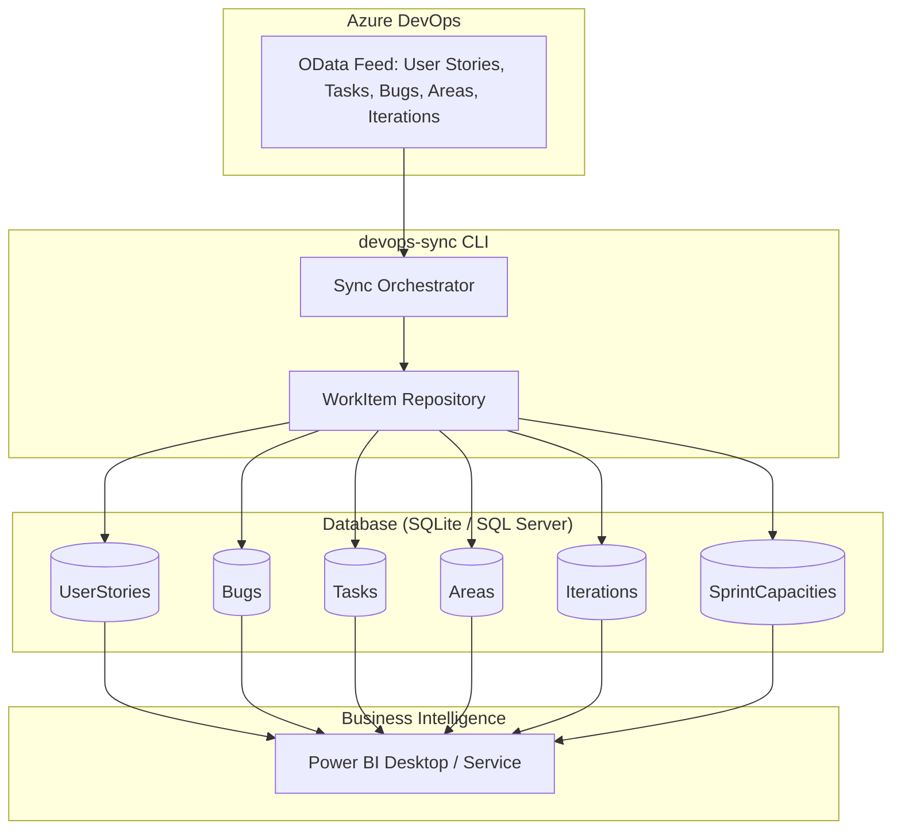

# Azure DevOps WorkItens Synchronization CLI

A C# CLI application designed to synchronize work items and supporting data from multiple **Azure DevOps** projects into a local **SQLite** or **Azure SQL Server** database. 

---

## Architecture

The tool fetches data from the Azure DevOps Analytics OData feed and the REST API, cleans or updates the target storage according to the selected run mode, and saves the data directly into a flattened schema.

### Basic Flow Diagram



---

## Application Settings

All configuration settings are managed via the standard `App.config` file.

## Configuration Property Descriptions

### 1. General Section
- **TfsUri**: Default base URL of your Azure DevOps Organization / Server.
- **PersonalAccessToken**: Default Personal Access Token (PAT) with Read access to Work Items, Project/Team configurations, and Analytics.
- **WorkItemSyncDate**: The start date threshold from which work items are extracted.
- **Storage Provider**: Storage engine provider. Supported values: `SQLite` or `SQLServer`.
- **Storage ConnectionString**: Connection string for your target database.
- **FilterTag Tags**: Semicolon-separated tags to filter work items (optional).

### 2. TeamProject Section
Each `<Project>` represents a project profile mapped in the database:
- **ProjectKey**: Unique local identifier (used to separate project data in the database tables).
- **ProjectName**: Target Azure DevOps project name.
- **AreaPath**: Hierarchical area path filter (e.g. `CM-APPS\CM-APPS\App Development`).
- **TeamName**: Team name used to fetch sprint capacities and iterations.
- **IterationLevel**: The hierarchy level where iterations reside.
- **TfsUri** / **PersonalAccessToken** *(Optional)*: Overrides the global general settings for this specific project.

---

## How to Use

The application is a non-interactive console utility designed to be called easily from command lines, task schedulers, or CI/CD pipelines.

### Executing the Command

The general command syntax is:
```powershell
devops-sync sync --mode <full|date|state> [--project <project-key>]
```

If running from the source folder using the .NET CLI:
```powershell
dotnet run --project AzureDevOpsToPoweBI.csproj -- sync --mode <full|date|state> [--project <project-key>]
```

### Execution Modes

You must specify one of the three synchronization modes:

1. **`--mode full`**  
   *Description*: A clean synchronization.  
   *Behavior*: Deletes **all** local database records of `UserStories`, `Bugs`, and `Tasks` for the target projects and performs a fresh full synchronization starting from `WorkItemSyncDate`.  
   *Use Case*: Recommended for the first execution, when schema migrations are updated, or to perform a complete data refresh.
   ```powershell
   devops-sync sync --mode full
   ```

2. **`--mode date`**  
   *Description*: Date-filtered incremental synchronization.  
   *Behavior*: Deletes and refetches local database work items created or modified on or after the general `WorkItemSyncDate`.  
   *Use Case*: Standard incremental sync run regularly (e.g., daily) to capture recent activity without rewriting older, closed history.
   ```powershell
   devops-sync sync --mode date
   ```

3. **`--mode state`**  
   *Description*: State-based update synchronization.  
   *Behavior*: Cleans and refetches all non-`Closed` work items in the database to ensure state changes (e.g., Active to Resolved/Closed) are properly updated.  
   *Use Case*: High-frequency synchronization (e.g., hourly) to keep active project boards up to date.
   ```powershell
   devops-sync sync --mode state
   ```

### Filtering by Project

By default, the application synchronizes **all** projects configured in the `TeamProject` section. To synchronize a single project, pass its `ProjectKey` via the optional `--project` argument:
```powershell
devops-sync sync --mode full --project CM-APPS
```